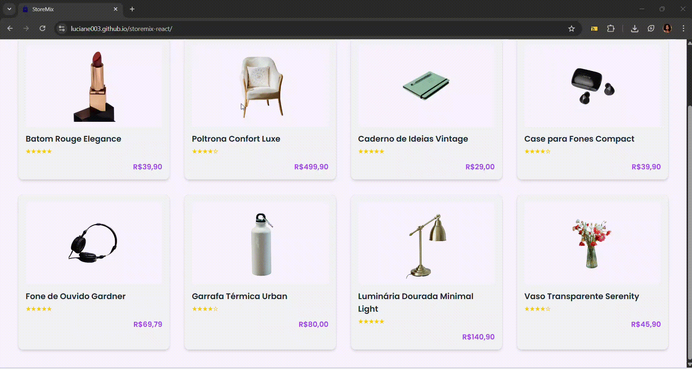

# StoreMix 🛍️

## Descrição
StoreMix é um projeto de front-end em React com TypeScript, focado em criar uma experiência moderna de loja online. Ele inclui funcionalidades como lista de produtos, detalhes individuais, carrinho de compras e um layout responsivo e um design estilizado.

## Desafios
Um dos principais desafios que enfrentei foi passar informações do componente pai para o filho no React. No início, achei um pouco confuso lidar com props e estados, mas com pesquisas e prática consegui entender a lógica e aplicar corretamente no projeto.

## Projeto online
[Projeto](https://luciane003.github.io/storemix-react/)
## Funcionalidades
- Listagem de produtos: todos os produtos aparecem em cards com imagem, nome, cor, tamanho e valor.

- Página de detalhes: ao clicar em um produto, é possível ver informações detalhadas.

- Carrinho de compras: adicionar, remover e atualizar quantidade de produtos.

- Avaliação de produtos: estrelas que indicam a nota de cada item.

- Mensagem animada: ao adicionar um produto ao carrinho, e ao comprar, aparece uma confirmação visual.

- Responsividade: o site se adapta a telas grandes e pequenas (mobile friendly).

- Navegação: usando HashRouter para controlar rotas dentro do app.

## Tecnologias 
<div style="display: flex; flex-direction: row; text-align: center">
  
  
   
  
  
  
</div>
<br>

# Como rodar o Projeto
Passo a passo para instalar dependências e rodar localmente:
```bash
npm install
npm run dev
```

## Visualização
<p align="center">
    
</p>

## Autora 
-  Luciane Kellen
- Feito como parte do meu processo de aprendizagem.
<div style="display: inline_block"><br> 
  <a href="https://www.linkedin.com/feed/" target="_blank"></a>
  <a href="https://wa.me/5517996417374" target="_blank"></a>
</div>


